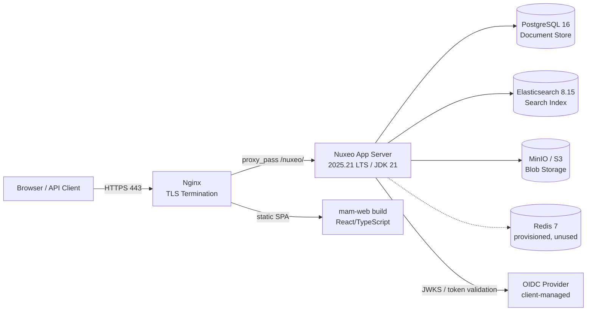

# MAM Platform — Administrator & Operations Guide

**Audience:** IT Administrators, DevOps/Platform Engineers

This guide expands on `deploy/README-DEPLOYMENT.md` with day-to-day operational runbooks. Read the deployment README first for initial setup; this guide assumes the stack is already deployed via `deploy/docker-compose.prod.yml`.

---

## 1. System Architecture



**Text description of the flow:**

1. All public traffic (browser and API clients) hits Nginx on port 443 (TLS terminated there).
2. Nginx serves the built React SPA as static files and reverse-proxies any request under `/nuxeo/` to the Nuxeo application container on port 8080.
3. Nuxeo persists document metadata in PostgreSQL, indexes documents into Elasticsearch for search/faceting, and stores binary content (video masters, proxies, thumbnails) in MinIO (or AWS S3 if configured).
4. Nuxeo validates incoming JWT Bearer tokens against the client's OIDC provider (JWKS endpoint or shared secret) — no traffic reaches Postgres/ES/MinIO without passing through Nuxeo's auth layer first.
5. Redis is provisioned and health-checked but not currently used by any request path — it is reserved for future caching/session needs.

**Container names** (as defined in `docker-compose.prod.yml`): `mam-prod-nginx`, `mam-prod-web-build` (one-shot init), `mam-prod-nuxeo`, `mam-prod-postgres`, `mam-prod-elasticsearch`, `mam-prod-redis`, `mam-prod-minio`, `mam-prod-minio-init` (one-shot init).

---

## 2. Daily Operations

### Checking Overall System Health

From the `deploy/` directory, with your `.env` file in place:

```powershell
docker compose -f docker-compose.prod.yml --env-file .env ps
```

All long-running services (`nginx`, `nuxeo`, `postgres`, `elasticsearch`, `redis`, `minio`) should show `Up (healthy)`. The one-shot services `mam-web-build` and `minio-init` should show `Exited (0)` — this is expected, not a failure.

### Checking Nuxeo Application Health

Nuxeo exposes a running-status endpoint. From the host (or via the reverse proxy):

```powershell
curl.exe -k https://<MAM_DOMAIN>/nuxeo/runningstatus
```

A healthy response returns HTTP 200 with a status payload. If this endpoint is unreachable, check the Nuxeo container logs before assuming the whole stack is down — Nginx may be healthy while Nuxeo is still starting (first boot commonly takes 2–5 minutes).

### Tailing Logs

```powershell
docker compose -f docker-compose.prod.yml --env-file .env logs -f nuxeo
docker compose -f docker-compose.prod.yml --env-file .env logs -f nginx
docker compose -f docker-compose.prod.yml --env-file .env logs -f elasticsearch
```

### Restarting a Single Service

```powershell
docker compose -f docker-compose.prod.yml --env-file .env restart nuxeo
```

Restarting `nuxeo` alone does not affect Postgres, Elasticsearch, or MinIO — data is untouched.

---

## 3. Backup & Restore Runbook

Backup and restore are handled by two scripts in `deploy/scripts/`: `backup.sh` and `restore.sh`. Both require a POSIX shell (use WSL, Git Bash, or a Linux jump host on Windows) and read your `.env` file via the `ENV_FILE` variable.

### What Is Backed Up

- **PostgreSQL**: A full logical dump via `pg_dump`, compressed with gzip.
- **Elasticsearch**: A filesystem snapshot of all indices, registered under the repository name `mam-fs-backup`.
- **MinIO / S3 binary objects are NOT backed up by this script.** Video masters, proxies, and thumbnails stored in MinIO must be protected separately — either through MinIO's own replication/versioning, or by snapshotting the `mam-prod-minio-data` volume at the infrastructure layer. Do not assume backups are complete without addressing this separately.

### Running a Backup

```bash
cd deploy/scripts
ENV_FILE=../.env ./backup.sh [BACKUP_DIR]
```

- `BACKUP_DIR` is optional and defaults to `./backups` relative to the script.
- Each run creates a timestamped subdirectory (UTC) containing:
  - `postgres-<PG_DB>-<timestamp>.sql.gz`
  - `es-snapshot-<timestamp>.json`
  - `manifest.txt` recording the database name, dump filename, and ES snapshot/repository names.
- The backup script never stops or restarts any service — it is safe to run against a live production stack.

### Setting Up a Cron Job

Example: nightly backup at 2:00 AM server time, retaining backups under `/opt/mam-backups`:

```cron
0 2 * * * cd /path/to/deploy/scripts && ENV_FILE=/path/to/deploy/.env BACKUP_DIR=/opt/mam-backups ./backup.sh >> /var/log/mam-backup.log 2>&1
```

Pair this with a weekly pruning job (or a retention policy in your backup storage) to avoid unbounded disk growth, since `backup.sh` does not delete old backups itself.

### Running a Restore

**This is a destructive operation.** Restoring drops and recreates the PostgreSQL public schema. Confirm you are restoring into the correct environment before proceeding.

```bash
cd deploy/scripts
ENV_FILE=../.env ./restore.sh <BACKUP_RUN_DIR>
```

- `<BACKUP_RUN_DIR>` must be one specific timestamped directory produced by `backup.sh` (not the top-level backups folder).
- The script requires you to type the exact PostgreSQL database name (`PG_DB`) as a confirmation gate before it proceeds.
- Sequence: stops the `nuxeo` container → drops and recreates the `public` schema → restores the compressed `pg_dump` → restarts `nuxeo`. Postgres, Elasticsearch, and MinIO containers themselves are never stopped.
- **Elasticsearch restore is not automated.** The script prints the exact `curl` commands needed to close indices and restore from the `mam-fs-backup` snapshot repository. Alternatively, after a Postgres restore, you can trigger a full reindex from Nuxeo's Admin Center ("Reindex all documents") instead of restoring the ES snapshot directly.

---

## 4. Troubleshooting Common Issues

### Elasticsearch Out of Memory

**Symptom**: Elasticsearch container restarts repeatedly, or search/indexing requests fail with 5xx errors.

**Fix**: Adjust the `ES_JAVA_OPTS` environment variable in your `.env` file (e.g., `-Xms2g -Xmx2g`), ensuring the heap size leaves adequate headroom under the container's memory limit (JVM heap should not exceed ~50% of available container RAM). After changing `.env`, recreate the Elasticsearch container:

```powershell
docker compose -f docker-compose.prod.yml --env-file .env up -d elasticsearch
```

### Video Upload Fails with HTTP 413

**Symptom**: Large MXF/MP4 uploads fail with `413 Request Entity Too Large`.

**Fix**: Check the `client_max_body_size` directive in `deploy/nginx/nginx.conf`. It is set to `10G` by default, which should accommodate broadcast masters. If you have an upstream load balancer or CDN in front of Nginx, confirm its body-size limit as well — Nginx's setting alone will not help if a device in front of it truncates the request first.

### JWT Auth Failing

**Symptom**: API requests with a valid-looking `Authorization: Bearer <token>` header are rejected with `401 Not authenticated`.

**Fix**: Verify, in order:
1. The OIDC provider's JWKS endpoint (`OIDC_JWKS_URL` / `mam.jwt.jwks.url`) is reachable from the Nuxeo container and is returning the expected signing keys.
2. The `iss` (issuer) and `aud` (audience) claims in the token exactly match the configured `OIDC_ISSUER` and `OIDC_CLIENT_ID`/audience values — these are strict string matches, not partial.
3. Clock skew between the token issuer and the Nuxeo host — token expiration is strictly enforced, so significant clock drift on either side will cause valid tokens to be rejected.
4. The token's groups claim (default claim name `groups`) contains role names that are mapped via the `mam.jwt.group.map.*` configuration properties to one of the internal groups (`mam-producers`, `mam-editors`, `mam-archivists`, `mam-publishers`, `administrators`). Unmapped external group names are silently dropped, not passed through — a user with no mapped group will authenticate but have no meaningful permissions.

### Elasticsearch Password Changes Not Taking Effect

**Symptom**: Search returns empty results or 401s after rotating `ELASTIC_PASSWORD` in `.env`.

**Fix**: `ELASTIC_PASSWORD` is baked into the Nuxeo image as a Docker build argument, not read purely at runtime. After changing this value, you must rebuild the Nuxeo image:

```powershell
docker compose -f docker-compose.prod.yml --env-file .env build nuxeo
docker compose -f docker-compose.prod.yml --env-file .env up -d nuxeo
```

---

## 5. Scaling

- **Nuxeo**: The current Compose topology runs a single Nuxeo application container. To scale horizontally, place multiple Nuxeo containers behind Nginx (or a dedicated load balancer) pointing at the same PostgreSQL and Elasticsearch backends, and increase `NUXEO_JVM_ARGS` per node based on available host memory. All Nuxeo nodes must share the same database and blob store to remain consistent.
- **Elasticsearch**: The stack ships as a single-node cluster (`discovery.type: single-node`) — adequate for the current data volumes but not resilient. To scale, provision additional Elasticsearch nodes, set `discovery.type` appropriately for a multi-node cluster (e.g., using `discovery.seed_hosts` and `cluster.initial_master_nodes`), and re-point the `ES_JAVA_OPTS` heap sizing per node.
- **PostgreSQL / MinIO**: Both are currently single-instance. For production hardening beyond this release, consider PostgreSQL streaming replication and MinIO distributed mode (multi-node erasure-coded deployment), which are infrastructure changes outside the scope of the current Compose file.

---
*For end-user workflows, see `USER_GUIDES.md`. For API integration details, see `API_OVERVIEW.md`.*
